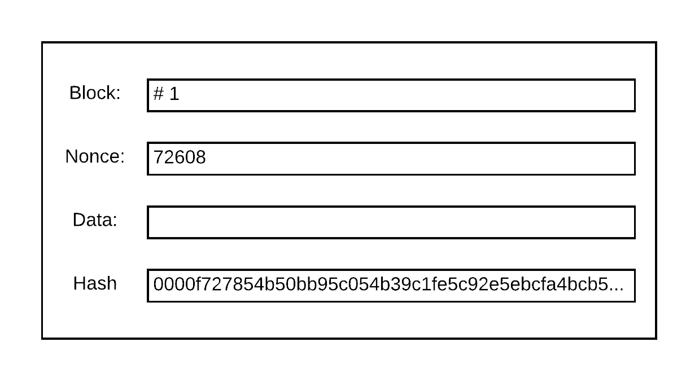
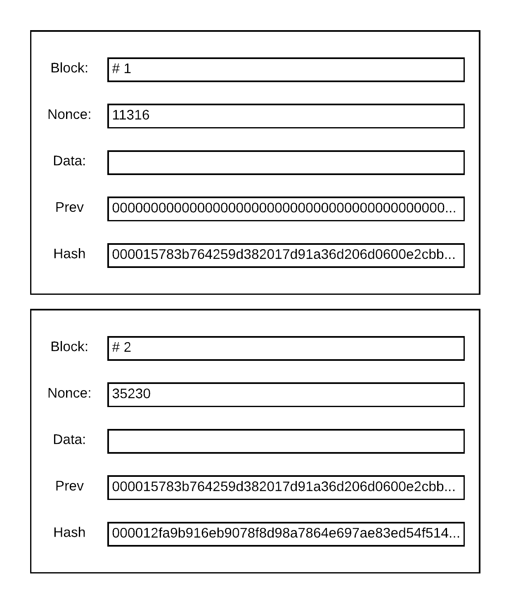
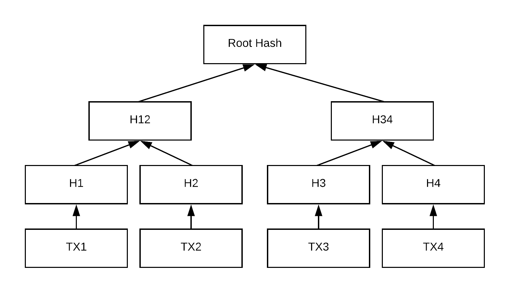
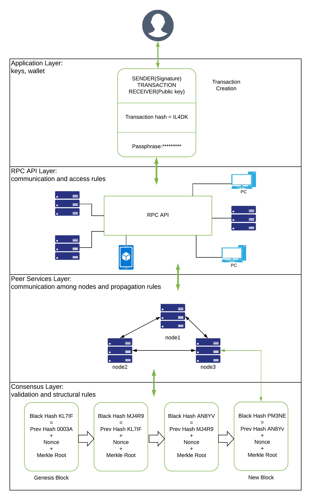
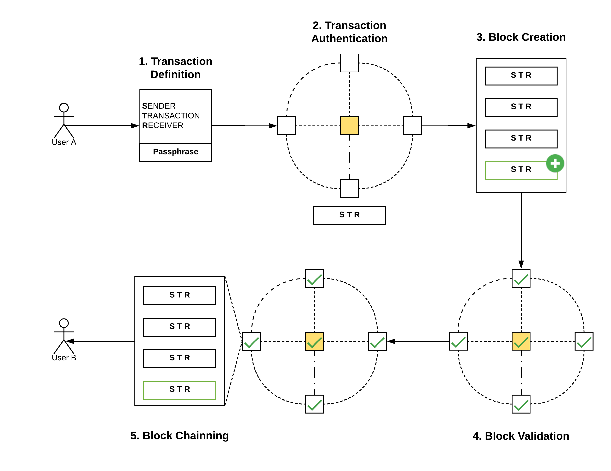

# Tóm tắt

Hầu hết chúng ta sử dụng cloud services (dịch vụ đám mây) gần như hằng ngày. Ta sử dụng những ứng dụng web như Gmail, Outlook, Yahoo! để trao đổi email. Ta sử dụng những mạng xã hội như Facebook, LinkedIn và Twitter để chia sẻ thông tin và kết nối với bạn bè của mình. Những dịch vụ lưu trữ đám mây như Google Drive, iCloud và Dropbox cho phép chúng ta lưu trữ nội dung số của mình một cách nhanh chóng. Nhu cầu giải trí có thể được đáp ứng bởi Netflix, Hulu. Và những dịch vụ này không chỉ dành cho cá nhân, những tập đoàn lớn đã và đang sử dụng những dịch vụ đám mây để deploy (triển khai) ứng dụng và dịch vụ của chính họ nhằm giảm chi phí vận hành. Một số ví dụ tiêu biểu có thể kể đến như Uber, Reddit và Netflix sử dụng Amazon Web Services, Github sử dụng Rackspace. Dịch vụ đám mây đã trở thành thứ không thể thiếu trong cuộc sống hiện đại của chúng ta.

Nhà cung cấp những dịch vụ chúng ta đang sử dụng có trách nhiệm chính trong việc bảo vệ thông tin cũng như quyền riêng tư của chúng ta. Cùng lúc đó, họ phải đảm bảo dịch vụ của họ luôn luôn khả dụng (availability), có thể mở rộng (scalability), và đáng tin cậy (reliability). Hiện tại những dịch vụ đám mây chúng ta sử dụng được thiết kế theo mô hình client-server, nơi những nhà cung cấp phát triển và duy trì dịch vụ của họ trên một server (máy chủ) tập trung, và người dùng (client) sẽ giao tiếp với server để có thể tiếp cận với những dịch vụ này. Tuy nhiên để sử dụng chúng, người dùng sẽ phải đăng ký với nhà cung cấp để tạo ra digital identity (danh tính số) của mình. Trong quá trình này, người dùng phải cung cấp từ những dữ liệu cơ bản nhất của mình, chẳng hạn như tên họ, username (tên người dùng), số điện thoại, email, cho đến những thông tin đặc biệt riêng tư như chi tiết thẻ tín dụng. Những dữ liệu này được lưu trên máy chủ tập trung (centralized server) được phát triển và duy trì bởi nhà cung cấp dịch vụ. Chính bởi tính tập trung này, những máy chủ tập trung là mục tiêu chính cho tin tặc.

Theo ZDNet vào năm 2016 [26]: trang mạng xã hội Tumblr đã bị thất thoát 65 triệu tài khoản người dùng, Yahoo! thông báo hơn 1 tỉ tài khoảng của dịch vụ này đã bị tin tặc cướp mất, LinkedIn cũng không phải ngoại lệ với 117 triệu tài khoản. Tuy nhiên tin tặc không phải là \_\_ duy nhất nhắm tới thông tin của người dùng, đôi khi chính những nhà cung cấp dịch vụ chia sẽ thông tin người dùng với những tổ chức khác mà không có sự đồng ý của người dùng. Cơ quan An ninh Quốc gia Mỹ (NSA) đã khai thác những gã khổng lồ công nghệ như Apple, Google, Facebook, Amazon Web Services (AWS) để theo dõi hoạt động của người dùng [41]. Những vấn đề này đã gây ra một cuộc tranh luận lớn về quyền riêng tư người dùng và ngày càng có nhiều người bắt đầu quan tâm đến việc bảo vệ quyền riêng tư trên mạng của chính mình.

Loại hình dịch vụ lưu trữ đám mây cũng không phải là ngoại lệ trong vấn đề này, hơn thế nữa, loại hình dịch vụ này còn gặp vấn đề lớn hơn vì không chỉ dữ liệu của người dùng bị thất thoát, mà cả content (nội dung) mà người dùng lưu trữ. Để phần nào giải quyết vấn đề đối với loại hình dịch vụ này, chúng tôi đã thiết kế và phát triển một prototype (nguyên mẫu) sử dụng công nghệ blockchain và bittorrent. Prototype này là một dịch vụ lưu trữ mà không yêu cầu người dùng chia sẽ dữ liệu cá nhân của họ cho nhà cung cấp. Việc xác thực và thanh toán được thực hiện bởi Ethereum blockchain, việc upload và download content được hiện thực dựa trên giao thức bittorrent. Prototype này cung cấp một self-contained digital identity system (hệ thống nhận diện kỹ thuật số độc lập) cho người dùng cùng lúc đó tạo nên một mạng lưới nơi mà mọi người có thể chia sẻ dung lượng trong máy của mình với nhau, nội dung của người dùng được lưu trữ bởi những người dùng khác, và chỉ riêng người sở hữu những nội dung đó mới có thể xem được. Qua đó, prototype này loại bỏ phần lớn sự phụ thuộc của người sử dụng dịch vụ với nhà cung cấp, nhưng vẫn cho phép nhà cung cấp triển khai logic của họ trong việc định danh người dùng cũng như dễ dàng mở rộng mạng lưới, và thu thập lợi nhuận để duy trì mạng lưới của mình.

# 1. Mở đầu

## 1.1 Báo cáo vấn đề

Chúng tôi nêu rõ vấn đề mà chúng tôi giải quyết như sau: Lưu trữ dữ liệu và nội dung của người dùng một cách tập trung như những nhà cung cấp dịch vụ lưu trữ đám mây vẫn đang làm tuy đã là tiêu chuẩn từ rất lâu nhưng giờ đây đã có nhiều hạn chế và chứa dựng nhiều mối nguy hiểm tiềm ẩn cho dữ liệu của người dùng. Để giải quyết vấn đề này, chúng tôi đã thiết kế và hiện thực một prototype, một mạng lưới chia sẻ dung lượng lưu trữ cùng với một hệ thống thanh toán mà không đòi hỏi người sử dụng phải chia sẻ thông tin cá nhân của mình.

## 1.2 Sơ lược nội dung

Ở chương này chúng tôi đề cập đến động lực, vấn đề và hướng giải quyết. Chương 2 mô tả các khái niệm chính về cách thức authentication (xác thực), storage (lưu trữ) và (billing) thanh toán hiện có của những dịch vụ lưu trữ đám mây hiện tại và những lổ hổng có thể có. Tiếp đó, chương 3 trình bày khái niệm chính về công nghệ Blockchain, kiến trúc của nó, cách nó hoạt động và các lỗ hổng của nó. Chương 4 mô tả các ứng dụng Blockchain phổ biến nhất. Chương 5 giải thích lý do đằng sau những công nghệ được lựa chọn để hiện thực prototype. Chương 6 bàn về thiết kế, kiến trúc, diagram (sơ đồ) của prototype. Chương 7 là cách thức chúng tôi hiện thực, triển khai prototype và cách mà nó hoạt động. Chương cuối cùng bàn về kết quả mới đạt được so với những gì hiện có.

# 2. Xác thực, Lưu trữ và Thanh toán

Cloud service được chia ra làm 3 loại: software as a service (SaaS), platform as a service (PaaS) và infrastructure as a service (IaaS). Cloud storage service là một dạng PaaS, trong đó nhà cung cấp cho người dùng dung lượng lưu trữ với sự đảm bảo về security (bảo mật), availability (khả dụng), consistency (nguyên vẹn). Kiến trúc được sử dụng phổ biến nhất để hiện thực loại dịch vụ này là client-server, trong đó client (người dùng) tương tác với server (máy chủ) chứa những business logic(logic nghiệp vụ) cần thiết. Xác thực là quá trình xác minh danh tính của người dùng, lưu trữ là quá trình nhà cung cấp lưu trữ cũng như serve (phục vụ) content của người dùng. Thanh toán là sự kết hợp của quá trình theo dõi tài nguyên sử dụng của người dùng và kiểm toán, phân tích dữ liệu.

[Figure 1: General Cloud Storage Service Architecture]

Hình 1 cho thấy kiến trúc phổ biến của cloud storage service với mô hình client-server, trong đó client có thể là một ứng dụng web hoặc ứng dụng máy tính có thể sử dụng tài nguyên tính phí của server sau khi đã được xác thực bởi server. Client tương tác với server bằng cách gửi request (yêu cầu) tới server. Authentication service được hiện thực trên server sẽ xác thực người dùng, nếu việc xác thực thành công, request sẽ được chuyển tiếp đến resource service để trả về resource mà người dùng cần. Trong trường hợp ngược lại, authentication service sẽ trả lỗi về client như trong Hình 1. Cuối cùng, Billing Service theo dõi lượng tài nguyên mà người dùng sử dụng để thực hiện việc kiểm toán và thanh toán.

## 2.1 Xác thực

Xác thực là cơ chế mà nhà cung cấp dịch vụ đám mây sử dụng để xác định người dùng trước khi cấp quyền truy cập cho họ. Nhà cung cấp cho phép người dùng sử dụng các dịch vụ của họ dựa trên các thông tin đăng nhập được cung cấp trong quá trình đăng ký. Việc xác thực thường được dựa trên 3 yếu tố: what-you-know (cái người dùng biết), what-you-have (cái người dùng có), và who-you-are (người dùng là ai). What-you-know là những thứ mà người dùng biết như: tên đăng nhập, mật khẩu hoặc mã PIN. What-you-have là những gì người dùng sở hữu như thẻ từ (thông tin nhận dạng được mã hóa trên thẻ flash), authenticator trên điện thoại thông minh. Who-are-you là những đặc điểm sinh trắc học mà chỉ có người dùng đó sở hữu như dấu vân tay, mống mắt.

### 2.1.1 Tên đăng nhập và mật khẩu

Tên đăng nhập và mật khẩu là phuơng thức xác thực được sử dụng nhiều nhất. Người dùng lần đầu tiên đăng ký cung cấp cho nhà cung cấp dữ liệu của họ như: tên đăng nhập, mật khẩu, email, số điện thoại, chi tiết thể tín dụng v.v... .Sau khi đăng kí hoàn tất, người dùng có thể truy cập dịch vụ sử dụng tên đăng nhập và mật khẩu họ đã cung cấp trong quá trình đăng kí. Tuy nhiên, đây không phải là phương pháp xác thực an toàn tuyệt đối, vì độ bảo mật của phương pháp này phụ thuộc vào độ dài và đặc điểm của mật khẩu. Và ngay cả mật khẩu phức tạp cũng vẫn có thể bị đánh bại bởi phương pháp brute-force (cơ bắp). Bên cạnh đó, mật khẩu phức tạp có xu hướng khó nhớ, và vì thế dẫn đến việc nhiều người dùng sử dụng một mật khẩu cho nhiều dịch vụ khác nhau.

### 2.1.2 Sinh trắc học

Xác thực bằng sinh trắc học là một trong những phương pháp xác thực tiên tiến nhất. Phương pháp này sử dụng đặc điểm sinh trắc học của người dùng như dấu vân tay, mống mắt, giọng nói, hoặc thậm chí là phân tích dáng đi để xác thực người dùng. Phương pháp này an toàn nhất so với các phương pháp xác thực khác vì một hệ thống làm việc chính xác đòi hỏi tin tặc phải có những đặc điểm sinh trắc học giống hoàn toàn với người dùng để có thể bẻ khoá, điều mà khả năng xảy ra là rất hiếm hoặc kẻ tấn công phải tiếp xúc với nạn nhân. Tuy niên công nghệ này vẫn còn rất tốn kém để thực hiện một cách đại trà và tính chính xác của công nghệ này vẫn còn là một vấn đề.

### 2.1.3 Multi-Factor

Multi-Factor authentication (xác thực đa yếu tố) là một phương pháp xác thực nâng cao sử dụng kết hợp what-you-know và what-you-have hoặc what-you-are để xác thực người dùng. Ví dụ: người dùng có thể sử dụng thẻ ATM cùng với mã PIN hoặc dấu vân tay. Tương tự, người dùng có thể truy cập vào dịch vụ đám mây bằng mật khẩu và mã từ một thiết bị phần cứng (thường là smartphone) được liên kết từ trước. Phương pháp này thân thiện với người dùng nhưng đòi hỏi chi phí triển khai cao hơn.

## 2.2 Lưu trữ

TODO

## 2.3 Thanh toán

Việc thanh toán được thực hiện bằng cách tổng hợp số liệu thống kế tài nguyên được người dùng sử dụng trong một khoảng thời gian nhất định kết hợp giá được định trước bởi nhà cung cấp. Tài nguyên này có thể là băng thông, dung lượng đĩa, hoặc thậm chí là lượt truy cập.

Một hệ thống thanh toán bao gồm ba service (dịch vụ) cơ bản: metering (đo lường), accounting (kiểm toán) và billing (thanh toán). Hệ thống này theo dõi tài nguyên mà người dùng sử dụng thông qua metering service, output của này là metering data sẽ được chuyển tiếp đến accouting service như trong Hình 2. Accounting service sẽ phân tích và tính toán lượn tài nguyên được sử dụng và tạo ra accounting data. Cuối cùng acouting data được sử dụng bởi billing service để yêu cầu người dùng thanh toán dựa trên thông tin người dùng cung cấp trong lúc đăng ký sử dụng dịch vụ.

[Figure 2: General Accounting Architecture].

## 2.4 Những lỗ hổng tiềm ẩn

Mặc dù các nhà cung cấp dịch vụ lưu trữ đám mây đã sử dụng những giao thức, công nghệ tiêu chuẩn được phát triển trong hơn một thập kỷ nhưng nhiều lỗ hổng tiềm ẩn lớn vẫn còn tồn tại như tấn công DDoS, brute-force, man-in-the-middle, v.v... . Theo báo cáo của Norton McAfee (công ty phần mềm bảo mật máy tính) năm 2014 và chi phí toàn cầu của tội phạm mạng, sẽ có tổn thất kinh tế toàn cầu từ 375 đến 575 tỷ đô la mỗi năm, cao hơn thu nhập quốc gia của hầu hết các quốc gia và chính phủ [23].

## 2.5 Những hạn chế

Những hạn chế chính của những dịch vụ lưu trữ đám mây hiện nay là chủ thể chính kiểm soát quyền sở hữu dữ liệu của người dùng là nhà cung cấp và chi phí triển khai và vận hành hệ thống rất cao. Những lý do đằng sau những hạn chế này là kiến trúc client-server được sử dụng bởi nhà cung cấp và điều khoản dịch vụ (Term of service). Term of service là những điều khoản mà người dùng phải đồng ý để sử dụng dịch vụ từ nhà cung cấp. hầu hết các term of service trao quyền sử dụng dữ liệu của ngưởi dùng cho nhà cung cấp. Do đó, với kiến trúc client-server, dữ liệu người dùng được lưu vào các máy chủ trung tâm, và với term of service, các nhà cung cấp hầu như có toàn quyền kiểm soát dữ liệu của người dùng. Nói cách khác mặc dù dữ liệu thuộc về người sử dụng, nó cuối cùng lại bị kiểm soát bởi các nhà cung cấp. Điều này nhấn mạnh những vấn đề về quyền riêng tư và bảo mật dữ liệu của người dùng cũng như có thể dẫn đến các lỗ hổng tiềm ẩn như được thảo luận ở mục 2.4.

# 3. Blockchain

Blockchain là một digital distributed ledger ("sổ cái" điện tử phân tán), chỉ có thể bị thay đổi bởi những transaction (giao dịch) được thêm vào bởi mạng lưới những người sử dụng và duy trì nó. Khái niệm blockchain lần đầu tiền được giới thiệu bởi Satoshi Nakamoto vào năm 2008 [1](Nakamoto, S.: Bitcoin: A peer-to-peer electronic cash system. Technical report, Bitcoin org, 2008.) và được nhắc đến như tiền đề cho công nghệ tiền ảo Bitcoin. Ý tưởng cốt lõi của Blockchain là tạo một kênh giao dịch tài sản giữa hai bên một cách nhanh chóng, tiết kiệm, an toàn, ổn định, minh bạch và đáng tin cậy mà không thông qua trung gian. Tài sản trong kênh giao dịch giữa hai bên là dữ liệu đảm bảo cho sự tin tưởng giữa hai bên, một số ví dụ có thể kể ra như: tiền, tài liệu, hợp đồng,...

Blockchain có thể tồn tại dưới dạng private (riêng tư) hoặc public (công khai). Public blockchain (blockchain công khai) cho phép mọi người có thể dùng nó ví dụ như blockchain của Bitcoin hoặc Ethereum. Trong khi đó private blockchain (blockchain riêng) yêu cầu người dùng phải được xác thực trước khi sử dụng và thường được tạo ra và chỉ được sử dụng bên trong một tổ chức nhất định ví dụ như một công ty chuỗi cung ứng có thể sử dụng private blockchain cho các giao dịch của họ.

Người dùng blockchain có thể nhỏ bé một cá nhân đam mê công nghệ hay cho đến các tập đoàn tài chính và thương mại như Nasdaq, Axoni, Deloitte, Finetch, The Linux Foundation, IBM v.v... . Các tập đoàn tài chính này đang thúc đẩy sự an toàn, ổn định, minh bạch và khả năng loại bỏ bên trung gian của blockchain cho lợi thế của họ. Nasdaq đang sử dụng blockchain để ghi lại tất cả các private transaction (giao dịch riêng tư) của họ. Deloitte đang làm việc với các startup và khách để phát triển một smart identity system (hệ thống định danh thông minh) cho khách hàng của họ là các ngân hàng. Linux Foundation đang phát triển dự án Hyperledger cho các doanh nghiệp. IBM có nhiều dự án mã nguồn mở liên quan đến Blockchain và đang xây dựng một ledger chuẩn công nghiệp. Startup Finetch được hỗ trợ bởi 40 ngân hàng toàn cầu để phát triển một kiển trúc chuẩn cho private ledger nhằm cắt giảm chi phí và thời gian giải quyết các giao dịch.

Trong lĩnh vực thương mại, Everledger và Factom vẫn đang tích cực phát triển công nghệ của họ dựa trên blockchain [36](). Everledger đang tập trung vào việc định danh và hợp pháp hóa các vật phẩm dựa trên blockchain. Tương tự, Factom cũng đang ứng dụng blockchain trong mảng bảo mật dữ liệu. Họ nhận tài trợ từ sở nội vụ Hoa Kỳ để thu thập dữ liệu từ các thiết bị ngoại vi. Hơn nữa, họ cũng làm việc cho nhiều dự án ở Trung Quốc để xây dựng một thành phố thông minh. Những thành phố đó tích hợp blockchain vào dịch vụ cung cấp điện, dịch vụ công chứng, giao dịch tài chính để đảm bảo sự chính xác của dữ liệu.

Ở các nước đang phát triển, blockchain có thể được sử dụng để chuyển tiền nhanh chóng từ nước ngoài và thực hiện giao dịch. Ngân Hàng Thế Giới và Liên Hợp Quốc đã khởi xướng các dự án khác nhau về digital identity (nhận dạng kỹ thuật số) được sử dụng để đăng ký đất đai và tài chính cho các doanh nghiệp vừa và nhỏ. Bên cạnh đó nhiều trường đại học như MIT, Princeton, Berkley đang nghiên cứu và hỗ trợ blockchain. Cũng có một cộng đồng blockchain W3 đang định hướng chuẩn hóa cho blockchain như định dạng tin nhắn, public-private blockchain và đánh giá các công nghệ mới liên quan tới block chain.

## 3.1 Thuật Ngữ

Tiểu mục này giải thích về các thuật ngữ cơ bản được sử dụng trong công nghệ blockchain. Những thuật ngữ này bao gồm Peer-to-peer network (Mạng ngang hàng), block, blockchain, distributed blockchain (blockchain phân tán, phi tập trung) và smart contracts (hợp đồng thông minh).

### 3.1.1 Peer-to-Peer network

Peer-to-peer (P2P) là một kiến trúc mạng phân tán nơi mà mỗi bên tham gia (máy tính) chia sẻ tài nguyên phần cứng như khả năng tính toán, lưu trữ, đường truyền với những bên còn lại. Mỗi máy tính trong mạng lưới được gọi là node, những node này chia sẻ tài nguyên với nhau mà không cần phải qua một bên trung gian như server, tại một thời điểm, một node có thể vừa là bên tiêu thụ vừa là bên cung cấp tài nguyên. Với những đặc tính này, P2P network cho phép người trong mạng lưới có khả năng sử dụng cũng như cung cấp tài nguyên của toàn mạng lưới mà vẫn có thể hoàn toàn ẩn danh.

Blockchain sử dụng kiến trúc mạng P2P để đảm bảo tính phân tán với không một single point of failure. Người bên trong mạng lưới blockchain được chia làm 2 bên: member peer (bên thành viên) và miner peer (bên khai thác). Member thay đổi dữ liệu bên trong blockchain bằng cách tạo ra transaction, những transaction này phải được thực hiện và xác thực bởi miner. Mỗi miner có một bản sao transaction history (lịch sử giao dịch) và có trách nhiệm duy trì, đồng bộ transaction history của mình với mạng lưới. Khi có một trasaction mới, miner đầu tiên thực hiện, xác thực và đồng bộ thành công transaction đó với mạng lưới sẽ nhận được phần thưởng từ mạng lưới và phí mà member đã bỏ ra khi tạo ra transaction đó.

### 3.1.2 Block

Blockchain được cấu tạo từ block, block là tập hợp của nhiều transaction và meta-data như được thể hiện ở Hình 3.1. Miner có nhiệm vụ thu thập những dữ liệu hợp lệ (transaction) trong một khoảng thời gian nhất định để tạo thành một block và tính toán hash (mã băm) trong meta-data của block đó. Tuy nhiên, hash được tạo ra phải có định dạng được quy định của mạng lưới, ví dụ blockchain ở hình 3.1 quy định một block hợp lệ phải có hash có ít nhất bốn số 0 đứng đầu. Hash của một block được tạo ra từ nhiều thông tin như hash của block trước, data bên trong block, và một số ngẫu nhiên. Để có được hash hợp lệ, miner phải thay đổi số ngẫu nhiên đó cho đến khi nào hash được tạo ra thoả mãn quy định của blockchain. Số ngẫu nhiên này được gọi là number used once or number once (nonce). Quá trình tìm ra nonce gọi là quá trình mining.

Hình 3.1 là một block mẫu có unique index (số thứ tự duy nhất), nonce, data và hash. Unique index là #1, Nonce là 72608, data là dữ liệu bất kỳ, trong trường hợp này là rỗng và hash của block data.

### 3.1.3 Blockchain

Blockchain là một sách liên kết của các hash pointer (con trỏ hash). Nó là một chuỗi của các block nơi mỗi block chứa một hash pointer tới block trước đó. Con trỏ hash này cho phép xác thực hash cửa dữ liệu trước đó. Nếu bất kì giá trị nào trong chuỗi bị thay đổi thì hash cũng thay đổi và con trỏ hash của block tiếp theo cũng bị thay đổi. Đặc điểm này giúp ta có thể duyệt con trỏ hash ngược lại tới bất kì block nào, thậm chí là tới khi gặp block đầu tiên - genesis block.

Hình 3.2 mô tả một blockchain gồm 2 block, mỗi block có một số thứ tự, nonce, data, hash của block trước và hash của block hiện tại. Vì Block #1 là genesis block của blockchain nên hash của block trước nó là null interger (số nguyên rỗng) (000000000000000000000000000000000000). Block #2 là block thứ 2 của blockchain và có con trỏ hash trỏ tới block 1 ở trước nó.

### 3.1.4 Smart contracts

Smart contract (Hợp đồng thông minh) là chương trình tự được thực thi dựa trên những logic được định nghĩa trước bởi người tạo ra nó. Smart contract về cơ bản là thoả thuận giữa những thành viên trong mạng lưới blockchain. Không như các hợp đồng truyền thống cần có một bên trung gian như ngần hàng, công chứng, smart contract có khả năng thực hiện hợp đồng giữa các bên một cách độc lập, ẩn danh với chi phí rẻ. Ví dụ như một người có thể thanh toán tiền phòng tự động vào cuối mỗi tháng mà không cần thông qua ngân hàng, một dự án crowdfunding sử dụng smart contract cho phép tiền của nhà đầu tư chỉ được rót vào khi nhà phát triển đạt được một milestone được định trước hoặc được chuyển ngược về các nhà đầu tư, một giao dịch mua bán sử dụng smart contract sẽ chỉ cho phép người bán rút tiền khi người mua nhận được hàng và xác minh hàng.

## 3.2 Mã Hóa

Tiểu mục này mô tả về các công nghệ mã hóa cơ bản được sử dụng trong blockchain. Bao gồm: hash, hash pointer, digital signature (chữ ký số) và Merkle tree.

### 3.2.1 Cryptographic hash function

Cryptographic hash function (Hàm băm) là một hàm toán học nhận đầu vào một dữ liệu bất kể độ dài và trả ra một kết quả với độ dài cố định gồm các chữ và số. Giá trị trả ra này được gọi là hash hay digest, digital fingerprint, checksum. Hàm là một pure function (hàm thuần), một pure function luôn luôn tạo ra output giống nhau với input giống nhau. Hash không thể bị dịch ngược để lấy giá trị đầu vào và vì thế, nó có thể được sử dụng để kiểm tra tính toàn vẹn của dữ liệu.

Hàm băm có ba thuộc tính chính: collision free, hiding và puzzle friendly.

- Collision free: cực kỳ khó để tìm hai tin nhắn có cũng hash. Ví dụ, một chuỗi x và y khác nhau sẽ có hash luôn luôn khác nhau.
- Hiding: không thể tìm giá trị của x từ hash của x
- Puzzle friendly: dễ dàng để tính hash của dữ liệu cho trước.

Blockchain sử dụng Secure Hash Algorithm (SHA) là SHA-2/SHA-256, được phát triển bởi cơ quan an ninh quốc gia Mỹ (NSA) trong năm 2001 nhằm thay thế SHA-1 để ngăn chặn tấn công collision free. Lỗ hổng của SHA-1 lần đầu tiên được phát hiển bởi Google, họ đã cung cấp 2 tài liệu khác nhau nhưng có cùng SHA-1 hash. SHA-2 được sử dụng rộng rãi và cho đến nay chưa có lỗ hổng bảo mật nào được phát hiện.

### 3.2.2 Hash pointer

Hash pointer là một con trỏ trỏ tới nơi dữ liệu được lưu trữ cùng với hash của data đó. Nói cách khác, nó chỉ là một đoạn hash được sử dụng để tham khảo tới một phần thông tin được biết trước đó, cùng lúc đó nó còn được dùng để dữ liệu bên trong block có thay đổi hay không. Con trỏ hash có thể được dùng để xây dựng những cấu trúc dữ liệu như blockchain - một danh sách liên kết của những con trỏ hash, hay cây Merkle - một cây nhị phân của con trỏ hash.

### 3.2.3 Digital signature

Digital signature sử dụng public-key cryptography (mã hoá khoá công khai) để cung cấp integrity (tính toàn vẹn) và tính xác thực về nội dung cũng như ngồn gốc của tin nhắn. Digital signature cũng có tính chất tương tự như chữ ký tay truyền thống, digital signature chỉ có thể được tạo bởi chủ sở hữu và dễ dàng xác thực bời người khác. Một tin nhắn được ký bởi digital signature có thể được xác thực bởi người khác, nhưng tin nhắn chỉ có thể được ký bởi chủ sở hữu. Digital signature số có thể được tạo ra từ public-key cryptography. Public-key cryptography hay asymmetric cryptography (mã hóa bất đối xứng) sử dụng một cặp khóa là public key và private key, private key được lưu trữ duy nhất bởi chủ sỡ hữu trong khi public key có thể được phân phối tới bất kỳ ai. Người dùng khác có thể mã hóa tin nhắn của họ gửi cho chủ sở hữu của key bằng các sử dụng public key của người đó và tin nhắn chỉ có thể được giải mã bằng private key của public key đó.
Blockchain sử dụng thuật toán ECDSA để tạo ra digital signature. Thuật toán này có 3 bước để tạo, ký và xác thực digital signature. Secret key (SK) và public key (PK) được tạo bởi phương thức generateKeys. SK chỉ được giữ bởi chủ sở hữu và PK được phân phát tới các node khác trong blockchain. Tin nhắn được ký sử dụng SK, quá trình ký sử dụng SK và tin nhắn để tạo ra chữ ký. Chữ ký này được xác thực bởi phương thức xác thực sử dụng PK, tin nhắn và chữ ký trong tin nhắn. Do vậy, PK đảm bảo tin nhắn được tạo bởi người ký, và không bị sửa đổi trong quá trình trao đổi.

Khi sử dụng distributed blockchain, người dùng không cần cung cấp mã an sinh xã hội, số điện thoại, email tới bất kỳ máy chủ tập trung hay cơ quan thẩm quyền nào. Họ có thể tạo digital identity của chính họ và phát tán PK của họ tới mạng lưới để trao đổi với những người khác. Đặc điểm này cho phép người dùng bên trong mạng lưới có thể hoàn toàn ẩn danh. Tuy nhiên, trong môi trường distributed blockchain này tất cả các node có bản sao của mọi giao dịch, đồng nghĩa với việc một node có thể thấy hết lịch sử của mọi giao dịch. Do vậy, một node có thể quan sát lịch sử giao dịch người dùng và có thể có thể truy ra hoặc đoán được danh tính thực của họ.

### 3.2.4 Cây Merkle

Blockchain dùng mạng P2P nơi mà mỗi node có cùng bản sao của dữ liệu và dữ liệu mới phải được lan truyền và xác minh bởi toàn mạng lưới. Đặc điểm này có một nhược điểm lớn là việc lan truyền và xác thực data qua mạng P2P rất tốn thời gian và chi phí tính toán. Cây Merkle được sử dụng để giải quyết việc xác thực block mới trên blockchain. Để 2 node xác thực một chuỗi dữ liệu, thay vì gửi data thì giờ đây node chỉ cần gửi Merkle root được tạo ra từ data đó, bên nhận sẽ kiểm tra sự toàn vẹn cũng như tính hợp lệ của dữ liệu bằng cách kiểm tra với Merkle root được tạo ra từ data của họ, việc kiểm này cực kỳ an toàn và hiệu quả trên một lượng dữ liệu lớn.

Cây Merkle là một binary tree (cây nhị phân) của hash pointer, Cây Merkle đảm bảo tất cả các node bên trong blockchain đều chứa dữ liệu hợp lệ. Lá của cây Merkle là hash của các transaction chứa trong một block. Những hash này sau đó được nhóm lại theo cặp và hash một lần nữa để tạo nên cấp độ tiếp theo của cây, quá trình này được lặp lại cho đến khi tìm được Merkle root như trong hình 3.3.

Hình trên mô tả cây Merkle bên trong một block và quá trình hình thành Merkle root. Block này chứa 4 transaction: TX1, TX2, TX3 và TX4. Hash của những transaction này là lá của cây Merkle bao gồm: H1, H2, H3, H4. Sau đó, những node lá được nhóm theo cặp và hash lại để tạo ra level tiếp theo của cây bao gồm H12 và H34. Cuối cùng H12 và H34 được gộp lại để tạo ra 1 hash duy nhất đó chính là gốc của Merkle root.

Sử dụng cây Merkle, ta có khả năng phát hiện bất kỳ sự thay đổi của transaction bên trong một block bằng cách đơn giản là chạy lại quá trình tạo ra Merkle root và so sánh với Merkle root ban đầu. Nếu một người dùng cố thay đổi hoặc đổi chỗ transaction trong một block, Merkle root được tạo ra từ những transaction trong block đó sẽ khác hoàn toàn với Merkle root ban đầu, giờ đây block này sẽ không được xác thực khi được lan truyền tới các node khác vì Merkle root của nó hoàn khác với Merkle root của chính nó bên trong những node khác.

## 3.3 Distributed Consensus

Distributed consensus (sự đồng thuận phân tán) trong blockchain là sự nhất trí giữa các node bên trong blockchain về một transaction. Về cơ bản, distributed consensus có thể được ví dụ như sau: Tưởng tượng bạn đang thiết kế backend cho một công ty như Google hoặc Facebook. Những công ty này có một mạng lưới server gồm hàng ngàn hoặc thậm chí hàng triệu node, những node này tạo thành một cơ sở dữ liệu phân tán lớn ghi lại tất cả các hành động xảy ra trên hệ thống như thêm một comment, like một post hay comment của người khác. Khi một comment mới được tạo ra, nhiều node khác nhau trong hệ thống sẽ có nhiệm vụ lưu trữ comment đó, những gì backend cần đảm bảo là comment đó được ghi lại bởi tất cả các node hoặc không có node nào lưu comment đó. Giả sử nếu một số node bị lỗi vì một lý do nào đó dẫn đến comment này sẽ không được ghi lại trong tất cả các node, ta có thể quay lại và nói với người dùng lỗi đã xảy ra. Nhưng nếu một số node đã lưu comment đó nhưng một số khác thì không, cơ sở dữ liệu của toàn hệ thống sẽ ở trạng thái inconsistent (không nhất quán). Blockchain sử dụng một giao thức distributed consensus để giải quyết vấn đề này. Ý tưởng cơ bản của giao thức này được diễn tả như sau: Không một node hay một bên trung gian nào có toàn quyền quyết định transaction nào nên được thêm vào blockchain. Thay vào đó, phần lớn những honest node (node đáng tin cậy) sẽ nhất trí với nhau để ra quyết định. Giao thức này cho phép nhiều node làm việc với nhau tạo thành một nhóm và trong trường hợp nếu một số node bị lỗi, hệ thống vẫn có thể đảm bảo tính nhất quán.

### 3.3.1 Proof-of-work

Proof-of-work là một giao thức đồng thuận phân tán lần đầu tiên được giới thiệu vào năm 1999 bởi Miguel Castro và Barbara Liskov để giải quyết The Byzantine general problem (bài toán Byzantine). The Byzantine general problem có thể được mô tả như sau: một nhóm các tướng lĩnh của quân đội Byzantine bao vây thành phố kẻ thù và được phép giao tiếp với nhau chỉ qua người đưa tin. Để chinh phục trận chiến, họ phải đạt được sự thống nhất về kế hoạch tác chiến. Tuy nhiên, vấn đề là họ rất có thể sẽ thua trận nếu có tướng lĩnh phản bội. Câu hỏi được đặt ra là có tối đa bao nhiêu tướng lĩnh phản bội mà đội quân có thể có mà vẫn có thể vận hành như một thể thống nhất. Tương tự, trong một hệ thống phân tán, vấn đề là có tối đa có bao nhiêu node bị lỗi mà hệ thống vẫn giữ được sự thống nhất.
Blockchain proof-of-work được đề xuất lần đầu tiên bởi Satoshi Nakamoto vào năm 2008 để giải quyết vấn đề double-spending [61]. Vấn đề double-spending là trường hợp người dùng cố gắng sử dụng cryptocurrentcy mà họ không sở hữu, nói cách khác là cố tình tạo ra những transaction không hợp lệ. Proof of work yêu cầu phải có một lượng sức mạnh tính toán đủ lớn để thêm một block vào blockchain, quá trình thêm này được gọi là mining.

Quá trình này được tạo ra với 2 mục đích:

1.  Xác thực tính hợp lệ của những transaction trong block được thêm vào.
2.  Duy trì mạng lưới bằng cách thưởng cho miner đã thêm được block mới.

Khi những miner có đủ transaction để đưa vào một block, họ sẽ xác thực tính hợp lệ của transaction trong block đó và cạnh tranh với nhau để đưa block đó vào blockchain bằng cách giải một mathematical puzzle (câu đố toán học), miner nào giải thành công câu đó trước sẽ truyền lời giải cho tất cả những miner khác. Lời giải cho câu đó có một đặc điểm quan trọng: tương đối khó để tìm ra, nhưng dễ để kiểm chứng, những miner khác trong mạng lưới sẽ kiểm tra lời giải hay nói cách khác 'proof-of-work' của miner này, và nếu phần lớn miner chứng thực lời giải cùng với những transaction chứa trong block là đúng thì block này sẽ được thêm vào blockchain và mạng lưới chính thức đạt được consensus (sự thống nhất) cho một block.

Tuy nhiên, proof of work có một số vấn đề: rất nhiều năng lượng tính toán bị lãng phí để tìm ra lời giải vì rất nhiều người thử giải câu đố khi có đủ transaction, nhưng chỉ một người được chấp nhận. Bên cạnh đó, dần dần những node nhỏ sẽ mất khả năng cạnh tranh và chỉ các node có công suất tính toán cao mới có lợi thế cạnh tranh trong việc mining. Việc này dẫn đến kết quả là chỉ số một ít miner mới có khả năng cạnh tranh để tham gia vào việc mining, điều này làm dần mất đi tính chất phân tán của blockchain.

### 3.3.2 Proof-of-stake

Proof-of-stake (POS) là một giải thuật để đạt được sự đồng thuận được đề xuất năm 2012 như một ứng cử viên thay thế cho proof-of-work (POW). Nó được sử dụng để xác nhận một khối giao dịch trong mạng blockchain và trừng phạt các nút vi phạm giao thức đồng thuận. Miner phải đặt cược cho kết quả đồng thuận hoặc giữ stake (cổ phần) của khối tài sản kỹ thuật số được định trước. Không như proof-of-work, thuật toán này chọn ngẫu nhiên một miner từ danh sách miner, sau đó miner đã được chọn được yêu cầu giải quyết một bài toán đơn giản. Nếu miner giải quyết thành công vấn đề tiền thắng cược hoặc tiền thưởng được trao dựa theo cổ phần đã đặt. Nếu thợ mỏ đầu tiền không giải quyết được bài toán được giao, thợ mỏ tiếp theo sẽ được chọn ngẫu nhiên. Do đó không có sự phân biệt mạnh yếu trong quá trình tìm kiếm lợi nhuận.
Những lợi thế chính của POS đối với POW là giảm tiêu thụ năng lượng và giảm phân cấp dẫn đến giảm cơ hội tấn công 51%. Bời vì POS chỉ thực hiện một phép toán đơn giản, các miner không cần một máy tính mạnh để tham gia đào mà thay vào đó, một máy tính vừa phải là đủ. Vì vậy. Do đó ít năng lượng bị lãng phí hơn và không có sự cạnh tranh khốc liệt về việc xây dựng các node có sức mạnh tính toán lớn để có được hiệu quả kinh tế. Hơn nữa, hầu như bất kỳ nút nào cũng có thể tham gia khai thác. Do đó, POS tiêu thụ ít năng lượng hơn và thúc đẩy sự tham gia rộng rãi hơn vào việc khai thác mỏ, làm tăng tính phân tán của blockchain.

## 3.4 Kiến Trúc của Blockchain

Kiến trúc tổng quát của blockchain được mô tả trong hình bên dưới. Kiến trúc được chia làm 4 lớp: Ứng dụng, RPC, API, Peer Service và Consensus Layer.
Lớp ứng dụng là nơi nhưng ứng dụng blockchain hoạt động, chúng cung cấp cho người dùng khả năng tương tác với mạng blockchain. Những ứng dụng blockchain có thể là ví hoặc phần mềm quản lý key, như là ledger wallet, chúng cung cấp định danh blockchain cho user bằng cách tạo public/private key, public key được chia sẻ trong mang và private key giữ bí mật. Hơn nữa, các giao dịch được cũng tạo ra trong lớp này. Một transaction chứa chữ ký kỹ thuật số của người gửi, giá trị của transaction và public key của người nhận như được mô tả trong hình bên dưới. Transaction này được ký bằng private key của người gửi, việc này giúp tạo nên định danh độc nhất cho hash của transaction. Dựa trên mức độ bảo mật được thực hiện bởi người gửi private key có thể được bảo vệ bằng sinh trắc học (vân tay, móng mắt) hoặc mật khẩu. Vì vậy, lớp này một mặt đảm bảo tính toàn vẹn dữ liệu của giao dịch, mặt khác cung cấp sự ẩn danh cho người dùng vì các private key của người dùng không chứa dữ liệu cá nhân (tên, họ, email, số điện thoại) được chia sẻ trong mạng.
Các ứng dụng blockchain còn lại là các ứng dụng web như BitInfoCharts và Info Blockchain, chúng cung cấp số liệu thống kê tiền điện tử cũng như giao diện, để bất kỳ người dùng nào cũng có thể truy vấn và xem giao dịch. Bên cạnh đó, người dùng có thể phát triển các ứng dụng blockchain của riêng họ bằng cách sử dụng Lớp RPC API.
Lớp API RPC là một lớp làm nhiệm vụ kết nối lớp Ứng dụng và Lớp dịch vụ ngang hàng như trong hình. Nó quy định các nguyên tắc để truyền thông tin và truy cập vào blockchain, các quy tắc được xác định từ trước bởi mạng blockchain. Các quy tắc này có thể dùng để xác định điểm truy cập cơ sở dữ liệu, mạng, quản trị viên, thống kê và debug API interfaces (giao diện API gỡ lỗi của blockchain). Nó cũng quy định API của Lớp dịch vụ ngang hàng nào được phép sử dụng bởi Lớp ứng dụng cũng như ai có thể truy cập vào ứng dụng. Những quy tắc này phụ thuộc vào môi trường blockchain đang hoạt động, là development (phát triển), test (thử nghiệm) hoặc production (sản phẩm), một ví dụ là JSON-RPC API. Trong mạng blockchain có những nút đặc biệt được gọi là miner, chúng kết nối với nhau tạo thành Tầng dịch vụ ngang hàng như trong hình.
Lớp dịch vụ ngang hàng là cốt lõi của blockchain thực hiện tất cả các tính toán cần thiết để xác nhận và xác minh các giao dịch và khối. Mỗi nút có bản sao lịch sử giao dịch có thể được xác minh ngược lại cho đến giao dịch đầu tiên. Điều này làm cho blockchain có tính phân quyền, phân tán, có khả năng chịu lỗi và đàn hồi vì không có SPOF và dữ liệu được phân phối trên nhiều nút. Mỗi nút trong lớp này đảm nhận việc

xác nhận các giao dịch nhận được từ tầng Ứng dụng là đúng định dạng, được ký bởi người gửi bằng chữ ký kỹ thuật số, khả thi (có đủ số dư để thực hiện giao dịch). Các nút này cũng xác thực người gửi bằng cách kiểm tra chữ ký số của họ. Cuối cùng, nút tạo ra một khối mới dựa trên các quy tắc xác nhận và cấu trúc được xác định trên Lớp đồng thuận.
Consensus Layer (lớp đồng thuận) lớp này đảm nhận vai trò xác nhận cấu trúc của khối được tạo bởi nút. Một khối hợp lệ phải có một hash, hash của khối trước đó, nonce và gốc merkle hợp lệ. Block hash là số nhận dạng độc nhất của một khối, previous block hash là con trỏ trỏ đến block hash trước đó, nonce liên quan đến POW (kết quả của việc giải một toán được đặt ra theo yêu cầu của lớp đồng thuận). Cuối cùng, gốc Merkle cho phép xác minh tất cả các giao dịch cho đến giao dịch đầu tiên. Nút nhận được một phần thưởng tài chính cho pow, sau đó block mới ngay lập tức được truyền tới mạng nơi tất cả node cập nhật sổ cái của họ tạo nên sự đồng thuận trên mạng. Nếu một giao dịch thay đổi trên một node, tất cả mode phải cập nhật thay đổi này và đào lại block. Do đó, sổ cái kỹ thuật số không thể bị thao túng và gian lận trong blockchain là rất khó xảy ra.

## 3.5 Cơ chế làm việc của Blockchain

Cơ chế làm việc của blockchain có 5 bước là Transaction Definition (định nghĩa giao dịch), Transaction Authentication (xác thực giao dịch), Block Creation (tạo block), Block Validation (xác nhận block) và Block Chaining (nối block). Transaction Definition là quá trình tạo ra một transaction theo định dạng được xác định trước bởi mạng blockchain. Để tạo ra một transaction cần có chữ ký số của người gửi, giá trị giao dịch và public key của người nhận và được ký bằng khóa kỹ thuật số được bảo vệ bằng pass-phrase (cụm từ - một hình thức private key) của người gửi. Transaction Authentication là quá trình các nút xác thực các bên liên quan có đủ số dư để gửi tài sản và có quyền để chuyển tài sản. Block Creation là quá trình tạo khối bằng cách nhóm giao dịch lại với nhau dựa trên thời gian tạo. Block Validation là quá trình xác nhận tính hợp lệ khối bằng cách kiểm tra xem nó có hash và nonce hay không. Block Chaining là quá trình thêm khối vào blockchain khi các nút đạt được sự đồng thuận. Một ví dụ về tạo blockchain, được mô tả trong hình bên dưới, trong đó Người dùng A chuyển tài sản kỹ thuật số cho Người dùng B. Tài sản có thể là tiền hoặc hợp đồng thông minh. Trong trường hợp này, đầu tiên cả hai người dùng tạo định danh số của họ với ví blockchain. A cần có khóa riêng của mình và public key của B để tạo ra Transaction. A nhận public key của B bằng cách quét địa chỉ blockchain qua QR code hoặc B gửi public key của mình tới A qua email. A tạo giao dịch được ký bằng khóa riêng tư của mình và thông báo tới mạng blockchain. Giao dịch này được nhận bởi một nút, nó xác thực và xác nhận tính. Nếu xác thực thất bại, giao dịch bị hủy bỏ, nếu không nó được nhóm lại với các giao dịch chờ xữ lý khác tạo thành một block, Block này được truyền tới block khác và khi mạng đạt được sự đồng thuần với block mới tạo, nó được thêm vào blockchain và khối này trở thành vĩnh viễn sau khi các khối tiếp theo được thêm vào blockchain. Cuối cùng, giao dịch được xác nhận và tài sản chuyển từ A qua B. Tùy thuộc vào mạng blockchain nó có thể mất 2 phút đến 10 phút dể các giao dịch được xác nhận. Ví dụ: Bitcoin 4.1 mất trung bình 10 phút trong khi Ethereum 4.3 mất 2 phút để xác định giao dịch.

## 3.6 Các lỗ hổng tìm ẩn

Blockchain nhanh hơn và rẻ hơn so với hệ thống tập trung vì thiết kế phân tán phân cấp của nó. Tuy nhiên, mặc dù nó đáng tin cậy và an toàn vì nó có giao thức đồng thuận, mã hóa và ẩn danh, blockchain vẫn có một số mối nguy hiểm tìm tàn như tấn công 51%, tấn công sybil, trộm danh tính và tấn công dựa trên mã nguồn.

### 3.6.1 The 51% attack (Tấn công 51%)

Một cuộc tấn công 51% có thể xảy ra khi một miner hoặc một nhóm miner kiểm soát 51% năng lực tính toán trên mạng blockchain. Khi đó họ có thể thống trị việc xác nhận và xác minh các giao dịch cũng như họ có thể thay đổi nội dung của blockchain. Hơn nữa, họ có thể làm mất hiệu lực các khối hợp lệ, tạo và hoàn thành các khối gian lận của chính họ nhanh hơn so với các miner trung thực. Bên cạnh đó, những kẻ tấn công có thể thay đổi quy tắc đồng thuận, ăn cắp tài sản từ người khác và thậm chí ngăn chặn việc tạo tiền điện tử. Cho đến nay không có sự cố xấu xảy ra do tấn công 51% mặc dù vào tháng 7 năm 2014, ghash.io đã khai thác hơn 51% mạng lưới Bitcoin. Nhưng, ngay sau đó các thợ mỏ đã ra khỏi bể khai thác này, do đó bi kịch đã không xảy ra. Loại hình tấn công này có thể bị ngăn chặn bằng việc sử dụng thuật toán đồng thuận POS.

### 3.6.2 Sybil attack (Tấn công mạo nhận)

Blockchain không có thẩm quyền để tập trung hay quản lý danh tính của những người tham gia. Kết quả là kẻ tấn công có thể tạo nhiều bản sao của chính mình, để giả dạng làm những người tham gia riêng biệt, sau đó kẻ tấn công cố gắng kết nối mạng với nạn nhân của nó. Vì vậy, node nạn nhân có khả năng chỉ kết nối với node tấn công. Kẻ tấn công sau đó có thể từ chối chuyển tiếp các block và giao dịch từ nạn nhân, ngắt kết nối nạn nhân khỏi mạng hoặc chỉ chuyển tiếp các block được tạo bởi chính nó. Cách tấn công này có thể tránh được bằng cách chỉ tin tưởng vào blockchain với POW lớn nhất vì nó không thể dễ dàng giả mạo vì yêu cầu năng lượng khai thác đáng kể.

### 3.6.3 Identity theft (Đánh cắp dữ liệu cá nhân)

Blockchain cung cấp khả năng định danh và danh tính kỹ thuật số được sao lưu bằng private key, private key phải được giữ an toàn, nếu nó bị đánh cắp hoặc thiết bị lưu trữ private key bị tấn công, nạn nhân sẽ mất tất cả tài sản kỹ thuật số cũng như nhận dạng kỹ thuật số đi kèm với private key đó. Hơn nữa, danh tính kỹ thuật số này không thể được phục hồi và nó sẽ gần như không thể tìm ra thủ phạm. Có nhiều ứng dụng khác nhau giúp mã hóa và đồng bộ hóa các khóa này lên các thiết bị khác nhau để khôi phục trong trường hợp thất lạc. Nhưng nếu các ứng dụng này có một số mã độc hại hoặc nếu chúng bị tấn công thì người dùng sẽ bị đánh cắp toàn bộ khóa của mình. Ngoài ra, việc đồng bộ hóa các mật khẩu trên nhiều thiết bị sẽ làm tăng khả năng bị tấn công.
Bên cạnh đó, với sự phát triển công nghệ, khả nặng tạo ra máy tính lượng tử ngày một cao, thứ có thể dùng để crack các loại mã hóa được sử dụng bởi công nghệ blockchain.

### 3.6.4 System hacking (Hack hệ thống)

Bản ghi của blockchain hay dữ liệu của nó không thể dễ dàng bị sử đổi hay thay thế. Tuy nhiên, mã nguồn và hệ thống chạy blockchain có thể dễ dàng sửa đổi và các công ty và tổ chức có thể phát triển blockchain của riêng mình dựa trên các blockchain mã nguồn mở. Ví dụ, các ứng dụng blockchain phổ biến nhất Bitcoin và Ethereum là mã nguồn mở. Do vậy, bất kỳ người dùng nào có thể đóng góp và quá trình phát triển blockchain và nếu người đóng góp mã nguồn không đủ tốt (ví dụ dễ bị tấn công hoặc trong mã nguồn), nếu không kiểm thử kĩ nó có thể được tải lên hệ thống thật. Trường hợp các công ty mở rộng mã nguồn blockchain để sử dụng riêng, nếu mã nguồn được bảo trì yếu kém hoặc lỗi thời nó có thể dẫn tới việc bị hack. Vào tháng 3 nằm 2014, sàn giao dịch bitcoin MtGox Tokyo đã bị hack và 700 triệu USD tiền bit bitcoin đã bị đánh cắp. Tương tự 2016, hacker đã khai thác lỗ hổng trên Decentralized Autonomous Organization (DAO) và đánh cắp 50 triệu USD tiền Ethereum.

### 3.6.5 Hành động bất hợp pháp

Các tính chất ẩn danh, bất biến và phi tập trung của blockchain làm cho nó gần như không thể điều hành và việc lần theo các giao dịch cũng là rất khó để thực hiện. Hơn nữa, bản thân công nghệ này đang ở giai đoạn đầu của quá trình hoàn thiện và các quy định và các điều luật thiết yếu để sử dụng ứng dụng blockchain đang cũng mới bắt đầu hình thành. Do đó, blockchain có thể bị lạm dụng để rửa tiền, chuyển quỹ bất hợp pháp. Ví dụ, Silk Road, một trang web để mua và bán các loại thuốc bất hợp pháp sử dụng bitcoin cho các khoản thanh toán của nó.

# 4. Ứng dụng của Blockchain

Blockchain có thể được sử dụng trong các lĩnh vực ứng dụng khác nhau như tài chính, phi tài chính, bảo hiểm, Internet of Things (IOT), chăm sóc sức khỏe, Internet, tiền điện tử. Một số ứng dụng tài chính như Medici, Blockstream, Bitshares và các ứng dụng phi tài chính như Stampery, Ascribe, BlockNotary. Everledger là ứng dụng bảo hiểm và IOT Filament, ADEPT platform là ứng dụng IOT. Ví dụ về các ứng dụng Internet là Namecoin, Ethereum. Ví dụ về các ứng dụng tiền điện tử là Namecoin, Bitcoin. Một số ứng dụng phổ biến nhất như Bitcoin, Namecoin và Ethereum được mô tả dưới đây.

## 4.1 Bitcoin

Bitcoin là ứng dụng phổ biến nhất được phát triển trên blockchain. Nó được đề cập lần đầu tiên bởi Satoshi Nakamoto vào năm 2008 trong white paper: 'Bitcoin: Hệ thống tiền điện tử Peer-to-Peer' mô tả một phương thức P2P để gửi tiền điện tử từ người này sang người khác mà không cần liên quan đến bên thứ ba.

Bitcoin được phát triển nhằm mục đích để giải quyết các thách thức tài chính hiện tại, hệ thống tài chính hiện tại được gắn chặt với các bên thứ ba như ngân hàng, công ty thẻ tín dụng để chuyển tiếp và xử lý các giao dịch tài chính. Các bên thứ ba xác nhận, bảo vệ các giao dịch và duy trì lịch sử giao dịch mà sau này lịch sử đó có thể được sử dụng làm bằng chứng về các giao dịch tài chính để tránh gian lận. Tuy nhiên, suy thoái kinh tế trong năm 2008 đã chỉ ra rằng những bên đáng tin cậy này có thể tạo ra bong bóng kinh tế dẫn đến hậu quả kinh tế thảm khốc.
Hơn nữa, bên thứ ba thường cần tiền từ người dùng để duy trì hoạt động giao dịch, nếu bên thứ ba bị phá sản hoặc bị tấn công, người dùng sẽ mất tài sản của họ. Ngoài những vấn đề nêu trên, các bên thứ ba còn sở hữu dữ liệu người dùng, họ có thể lạm dụng và chia sẻ nó với các tổ chức như Cơ quan An ninh Quốc gia Mỹ (NSA) hoặc các tổ chức khủng bố.
Bitcoin là tiền điện tử thành công nhất trong lịch sử. Đồng Bitcoin đầu tiền được đào vào ngày 3 tháng Một 2009 và vào ngày 9 tháng Một 2009 bitcoin v0.1 đã được phát hành. Giao dịch đầu tiên được hoàn thành vào tháng Năm 2010 nơi một người dùng mua một cái pizza với giá 10000 bitcoin. Kể tứ đó, giá trị của bitcoin đã tăng vọt so với tiền giấy.
Bitcoin sử dụng mạng P2P thay vì bên thứ ba để thực thi giao dịch giữa hai người dùng qua Internet. Nó dựa trên chữ ký kỹ thuật số mà nền tảng là mã hóa public key để tạo niềm tin thay vì phải nhờ đến bên thứ ba đáng tin cậy. Mỗi người dùng tạo một cặp private key và public key, public key được thông báo cho tất cả người dùng trong mạng, trong khi private key được người dùng lưu giữ an toàn. Vì vậy, danh tính người dùng vẫn được giữ bí mật. Tuy nhiên, tất cả mọi người trong mạng có thể thấy giao dịch Bitcoin được chuyển từ người dùng A sang người dùng B.
Khi một bitcoin được gửi đến public key của người nhận, một giao dịch được tạo ra, nó được bảo vệ bảo vệ bằng private key của người gửi. Trong quá trình này người gửi phải chứng minh quyền sở hữu đối với tài sản bằng private key của mình và giao dịch này được xác minh bởi miner bằng public key của người gửi. Thợ mỏ đảm bảo người gửi có đủ số dư bitcoin để chi tiêu và lượng bitcoin đó được sở hữu bởi họ, mỗi giao dịch đều được thông báo đến tất cả các node trong mạng. Sau khi xác minh và xác nhận, khối được nối vào blockchain.
Một người dùng có thể bắt đầu sử dụng Bitcoin bằng cách tạo ra tài khoản bitcoin, điều này được thực hiện bằng cách tải ví Bitcoin và tạo tài khoản. Bitcoin có thể được đổi từ tiền mặt bằng cách sử dụng các sàn giao dịch bitcoin như Bistamp, Bitsquare, Kraken.
Ngoài ra, người dùng có thể phát triển ứng dụng Bitcoin như Namecoin bằng cách fork (tạo nhánh) mã nguồn của bitcoin và sửa đổi nó để hỗ trợ mục đích sử dụng của riêng.

### 4.1.1 Transactions (Giao dịch)

Trong mạng blockchain, nhiều giao dịch có thể diễn ra tại một thời điểm nhất định và bất kỳ node nào cũng có thể thu thập các giao dịch chưa được mã hóa để tạo thành khối và lan truyền các khối này vào mạng. Các giao dịch được nhóm lại với nhau là vì các giao dịch không có giá trị được tạo trên mạng gây ra sự chậm trễ, sau khi được nhóm thành block, block này nối với block trước đó nhờ sử dụng hash của block trước đó, sau đó block được thêm vào blockchain sau khi miner đã giải xong một bài toàn phức tạp. Miner đầu tiên giải được bài toán, nói cách khác là miner tạo POW đầu tiên, lang truyền kết quả tới mạng sẽ nhận được một phần thưởng tài chính. Thường thì cần rất nhiều năng lực tính toán để tạo ra POW, tuy nhiên việc xác minh lại rất đơn giản, chỉ cần chạy một hàm hash. Độ khó của bài toán được điều chỉnh sao cho bài toán được giải quyết trung bình cứ 10 phút một lần. Phần thưởng này là 50 bitcoin trong lần đầu và nó được giảm đi một nửa mỗi bốn năm để đảm bảo cung cấp bitcoin vừa phải và tránh lạm pháp. Kết quả là, số lượng Bitcoin tối đa sẽ được tạo ra vào năm 2140. Thỉnh thoảng có nhiều hơn một khối sẽ được giải quyết đồng thời dẫn đến một số nhánh được tạo ra trên blockchain, khi đó chỉ có nhánh dài nhất được coi là hợp lệ.
Mỗi giao dịch Bitcoin có ba phần: metadata, input và output. Metadata chứa timestamp (thời gian transaction được thêm vào blockchain), kích thước transaction và hash SHA-256 của toàn bộ giao dịch. Hash được xem như ID độc nhất của giao dịch. Phần thứ hai là input, input là một mảng mà trong đó mỗi phần tử tham chiếu tới giao dịch trước. Cuối cùng, phần thứ ba là output, nó cũng là một mảng, thứ chứa chỉ dẫn để gửi bitcoin tới public key của người nhận. Những phần tử trong output ra có một giá trị số nguyên, nó cho biết số tiền sẽ được gửi đi và scriptPubKey là ECDSA hash của public key. Số tiền nói trên được tính bằng đơn vị bitcoin và đơn vị bitcoin nhỏ nhất được gọi là satoshi, nơi 10^8 satoshi bằng một bitcoin. Đầu ra cũng có một đoạn mã ngắn: scriptPubKey như trong hình cho biết hash ECDSA của khoá công khai và một quy trình xác thực chữ ký, đại diện cho các điều kiện mà giao dịch này phải đáp ứng. Để thực hiện thành công giao dịch, sciptSig và tệp scriptPubKey phải được thực hiện thành công theo thứ tự.

### 4.1.2 Ngôn ngữ kịch bản

Bitcoin cung cấp một ngôn ngữ kịch bản, được thiết kế và phát triển dành riêng cho Bitcoin chỉ với 256 hướng dẫn. Nó là ngôn ngữ lập trình stack với mục đích hỗ trợ cho hoạt động mã hóa dữ liệu hash và xác minh chữ ký. Thiết kế của ngôn ngữ theo kiến trúc ad-hoc, non-Turing, điều này đồng nghĩa với việc nó không có khả năng tính toán mẽ tùy ý và mọi lệnh được thực thi một cách tuyến tính chính xác một lần. Nó không hỗ trợ vòng lặp bởi vì các thợ mỏ phải thực thi các kịch bản được gửi bởi những người tham gia từ bất kỳ đâu nên nó cần tránh các vòng lặp vô tận. Khi kịch bản được thực hiện, chỉ có hai kết quả có thể có hoặc là nó thực hiện thành công mà không có lỗi và giao dịch là hợp lệ hoặc có một lỗi trong khi kịch bản đang thực hiện. Trong trường hợp thứ hai, toàn bộ giao dịch sẽ không hợp lệ và không được chấp nhận để nối vào blockchain.

### 4.1.3 Mạng Bitcoin

Giao dịch Bitcoin có thể được thực hiện trên ba mạng, main-net (mạng chính), test-net (mạng thử nghiệm) và private-net (mạng riêng). Main-net là mạng Bitcoin chính, nơi bitcoin được yêu cầu cho các giao dịch. Mạng thử nghiệm cũng là mạng công cộng của Bitcoin nhưng có khối genesis khác mạng chính và đã được đặt lại ba lần. Mạng thử nghiệm không yêu cầu bitcoin thực và được dùng cho việc thử nghiệm các ứng dụng bitcoin trước khi triển khai lên mạng chính. Mạng chính và mạng thử nghiệm được phát triển và duy trì bởi nhóm các nhà phát triển Bitcoin trong khi mạng riêng có thể được triển khai bởi bất kỳ ai để sử dụng cho mục đích cá nhân hoặc để hỗ trợ các công ty cho từng trường hợp sử dụng của riêng họ. Ngoài ra, việc khai thác trong mạng riêng nhanh hơn mạng thử nghiệm vì có ít người dùng và giao dịch hơn so với mạng thử nghiệm hoặc mạng chính.

### 4.1.4 Lợi thế

Công nghệ Bitcoin có một số ưu điểm so với các hệ thống tài chính hiện có sử dụng kiến ​​trúc server-client nơi người dùng được đăng ký với máy chủ trung tâm và máy chủ trung tâm sở hữu dữ liệu người dùng. Công nghệ Bitcoin an toàn vì các giao dịch được bảo mật bằng mã hóa công khai và niềm tin được thiết lập trên mạng P2P. Nó rẻ hơn vì các giao dịch được lang truyền ngay lập tức qua mạng P2P và chúng được truyền đi nhanh nhất có thể đến các nút khác. Ngoài ra, chi phí xử lý giao dịch trung gian thấp hơn hệ thống tài chính hiện có. Bên cạnh đó, mạng còn có tính chất phân tán và giao dịchđã thực hiện là không thể thay đổi, được lưu vĩnh viễn vào sổ cái phân tán. Sổ cái này giúp dễ dàng phát hiện gian lận và chứng minh quyền sở hữu với tài sàn và giao dịch.

### 4.1.5 Những mối đe dọa

Bitcoin có một số lỗ hổng và các hạn chế như nó không hoàn toàn có thể mở rộng vì chỉ có một lượng Bitcoin giới hạn (khoảng 21 triệu). Nó tốn thời gian để các giao dịch được xác nhận là 10 phút. Vì vậy, phải mất một giờ để có được sáu khối mới được thêm vào blockchain. Kích thước blockchain của Bitcoin đã tăng từ 50GB lên 120GB và nó luôn tăng lên. Ngoài ra, sức mạnh tính toán cần để giải quyết vấn đề toán học tăng theo cấp số nhân mọi lúc. Kết quả là, chỉ một số nút có công suất tính toán cao mới có thể trở thành thợ mỏ thực thụ, điều này có thể phá vỡ nguyên tắc của hệ thống phân tán. Chi phí năng lượng dành cho tính toán ngày càng cao. Nếu tin tặc lấy cắp khóa cá nhân của người dùng, họ có thể lấy cắp định danh của người dùng và khôi phục là điều không thể, người dùng sẽ mất tất cả bitcoin của mình mãi mãi. Ví dụ, vào tháng 2 năm 2014 Mt. Gox, sàn giao dịch Bitcoin lớn thứ ba trên thế giới có 850.000 bitcoin bị đánh cắp và do đó công ty phải tuyên bố phá sản.

## 4.2 Namecoin

Namecoin là một tiền điện tử thay thế (alt-coin) dựa trên giao thức BitDNS với ý định tạo ra censor-resistance domain name system (hệ thống kiểm duyệt tên miền) nằm ngoài sự kiểm soát của bất kỳ thực thể duy nhất nào. Hệ thống sử dụng blockchain để quản lý tra cứu tên miền thay vì sử dụng máy chủ tập trung như Internet Corporation for Assigned Names and Numbers (ICANN), thự hiện tài đòi hỏi sự tin tưởng vào cơ quan trung ương và có thể tạo ra SPOF. Namecoin là fork đầu tiên của mã nguồn bitcoin với blockchain riêng của nó. Nó sử dụng các tính năng cốt lõi của Bitcoin chẳng hạn như pow, thời gian tạo khối cùng với các tính năng bổ sung như name/value store. Name/value store là một cơ sở dữ liệu giao dịch blockchain nơi người dùng có thể lưu trữ tùy ý dữ liệu định danh như username, email hoặc địa chỉ web. Nó được sử dụng chủ yếu để định danh trang web và nó cho phép đăng ký và phân giải tên miền cho tên miền cấp cao nhất (top-level domain TLD) .bit.
Tam giác Namecoin Zooko (Namecoin squares Zooko Triangle, Zooko Triangle là một Trilemma – Bộ ba bất khả thi, Zooko Triangle là một bộ ba bất khả thi của 3 thuộc tính Humman-readable, Secure và Decentralized) cho phép đặt tên miền có cả ba thuộc tính human-readable (đọc được), decentralized (phân cấp) và authenticated (chứng thực). Human-readable nghĩa là người dùng có thể chọn một tên miền gồm các ký tự mà con người đọc được. Decentralized có nghĩa là không có bên trung tâm đáng tin cậy hoặc SPOF. Authenticated nghĩa là người dùng được sở hữu mạnh mẽ tên miền này nhờ sử dụng cặp khóa mã hóa. Cho đến năm 2011, việc thiết kế một hệ thống có thể có tất cả ba thuộc tính này là điều không thể. Tuy nhiên, Namecoin là hệ thống đầu tiên cung cấp hệ thống có tất cả ba thuộc tính.
Namecoin cyptocurrency được gọi là namecoin và đơn vị của nó có ký hiệu là NMC, người dùng còn có thể đăng ký tên miền .bit tại dotbit.me với một khoản phí rất nhỏ là 0,01 BTC, 5 hoặc 20 NMC. Tương tự như bitcoin, Namecoin cũng bị giới hạn tới 21 triệu đồng. Khối Namecoin đầu tiên được khai thác vào tháng 4 năm 2011.
Dựa trên Namecoin, các ứng dụng khác nhau như OneName và Blockstack đã được phát triển. OneName sử dụng blockchain Namecoin để ghi lại dữ liệu thành viên trong khi Blockstack cung cấp chức năng tương tự với nền tảng Bitcoin blockchain và giới thiệu khả năng hỗ trợ phát hành những ứng dụng chạy mà không cần có server.

## 4.3 Ethereum

Ethereum được biết đến như blockchain phổ biến thứ 2. Nó được phát triển để giải quyết những điểm yếu của bitcoin. Điểm yếu đầu tiên là ngôn ngữ kịch bản bitcoin có giới hạn số lệnh và non-Turing. Ngôn ngữ kịch bản của bitcoin tập vào trường hợp sử dụng bitcoin. Việc phát triển các ứng dụng bằng cách sử dụng kịch bản lệnh Bitcoin đòi hỏi các nhà phát triển phải mở rộng mã nguồn bitcoin và thêm logic cho các trường hợp sử dụng riêng của họ. Việc này tiêu tốn thời gian và khó để duy trì lâu dài. Do đó, để giải quyết những thách thức này, Ethereum đã được phát triển. Ethereum cung cấp một nền tảng cho các lập trình viên để xây dựng các ứng dụng trên một blockchain được gọi là một blockchain Ethereum. Nó được đề xuất đầu tiên vào cuối năm 2013 bởi một lập trình viên Bitcoin tên là Vitalik Buterin trong Ethereum Whitepaper: Một hợp đồng thông minh thế hệ tiếp theo và nền tảng ứng dụng phân cấp '. Luận án này đề xuất một ngôn ngữ lập trình Turing hoàn chỉnh để viết kịch bản (hợp đồng thông minh) và các Máy ảo Ethereum (EVM) để thực thi các hợp đồng và giao dịch thông minh.
Người dùng Ethereum có thể tạo các hợp đồng thông minh và tải chúng lên Ethereum Blockchain với một khoản phí nhỏ. Những người dùng Ethereum khác có thể truy cập các hợp đồng này bằng các cuộc gọi thủ tục từ xa được cung cấp bởi Ethereum Application Program Interface (EAPI). Hợp đồng có thể chứa dữ liệu, gửi giao dịch và tương tác với các hợp đồng khác. Các hợp đồng được dịch thành bytecode sau chúng được tải lên blockchain, chúng được lưu trữ, thực hiện bởi EVM. EVM yêu cầu một khoản phí nhỏ để thực hiện giao dịch. Các khoản phí này được gọi là gas và lượng gas phụ thuộc vào kích thước của lệnh. Số lệnh hợp đồng càng dài thì gas càng nhiều. Ngoài ra, Ethereum có tiền điện tử riêng được gọi là ether và nó được trình bày bằng chữ viết tắt ETH. Ether là một loại tiền để sử dụng ứng dụng trên mạng Ethereum. Đơn vị nhỏ nhất của ether là Wei. Một ether bằng 10^18 Wei. Người dùng có thể sử dụng Ethereum để đổi thành tiền mặt hoặc ngược lại.

### 4.3.1 Ethereum Blockchain

Ethereum blockchain tương tự như blockchain bitcoin với một số điểm khác biệt nhất định trong kiến ​​trúc. Các điểm khác biết được liệt kê như sau: blockchain Ethereum chứa một bản sao của cả danh sách giao dịch và cả trạng thái gần đây nhất, thời gian tạo khối là 12 giây một lần, Ethereum blockchain sử dụng giao thức GHOST để đạt được nhánh đồng thuận với pow được gọi là Ethash (đã có kế hoạch để chuyển từ POW sang POS), yêu cầu tối thiểu 6 lần xác minh giao dịch để giao dịch được chấp thuận và người khai thác nhận được phần thưởng là 5 ether.
Người dùng cần một tài khoản để sử dụng Ethereum. Một tài khoản có bốn trường: nonce, số dư ether, mã hợp đồng và vùng lưu trữ. Các nonce đảm bảo một giao dịch được xử lý chỉ một lần. Số dư Ether là số tiền mà người dùng có. Mã hợp đồng chứa các hợp đồng thông minh do người dùng triển khai cho EVM. EVM cung cấp môi trường để thực hiện hợp đồng và lưu trữ liên tục để lưu dữ liệu. Tài khoản Ethereum có hai loại, tài khoản external (bên ngoài) và tài khoản contract (hợp đồng). Tài khoản external được sở hữu và tạo bởi người dùng và được kiểm soát bằng khóa riêng. Tài khoản hợp đồng được kiểm soát bởi mã hợp đồng. Các tài khoản Ethereum tạo ra các giao dịch và tin nhắn.

### 4.3.2 Giao dịch và tin nhắn

Nói một cách đơn giản, giao dịch là gói dữ liệu được người gửi ký, dữ liệu đó được gửi từ một tài khoản external. Một giao dịch ethereum chứa địa chỉ người nhận, chữ ký số của người gửi, số tiền ether được gửi đến người nhận, dữ liệu, startgas và gasprice. Địa chỉ nhận là địa chỉ public key của người nhận còn chữ ký số được dùng để xác thực người gửi. Trường dữ liệu trong giao dịch etherum là trường không bắt buộc phải có và cũng không có chức năng trong hệ thống, tuy nhiên nó có thể được sử dụng bởi máy ảo có opcode (operation code - mã hoạt động) để cung cấp dữ liệu chạy smart contract. Startgas và gasprice dùng để tránh tính huống các vòng lặp tiêu hao hết gas. Mỗi bước tính toán yêu cầu 1 gas, ngoài ra phải trả thêm 1 gas cho mỗi 5 gas tiêu thụ. Mọi giao dịch phải xác định trước bao nhiêu gas sẽ được dùng. Nếu một giao dịch đang thực thi mà hết gas nó sẽ dừng lại. Do đó, một điều quan trọng khi thực hiện các giao dịch trong ethereum là bạn nên cung cấp đủ gas cho nó. Ethereum theo thiết kế không thích hợp cho các hợp đồng tính toán nặng khi việc tạo và thực hiện các smart contract là rất tốn kém. Tạo và thực thi một hợp đồng yêu cầu ether, nhưng việc truy vấn một hợp đồng không yêu cầu bất kỳ ether nào. Giả sử có một hợp đồng có hai chức năng đăng ký và liệt kê người dùng, trong đó, đăng ký người dùng yêu cầu ether nhưng truy xuất danh sách người dùng không yêu cầu bất kỳ ether nào.
Không giống như giao dịch, tin nhắn được tạo ra bởi tài khoản contract thay vì tài khoản external. Tin nhắn được tạo ra khi một hợp đồng gửi thông tin đến hợp đồng khác bằng cách thực hiện mã lệnh CALL. Các thông điệp chỉ sống trong môi trường thực thi Ethereum. Tương tự như giao dịch, tin nhắn cũng có người gửi, người nhận, ether được gửi, giá trị dữ liệu và giá trị startgas.

### 4.3.3 Smart Contracts

Hợp đồng thông minh là một thành phần quan trọng tạo nên sự thành công của Ethereum. Nó là một chương trình tự trị, tự thực thi trong môi trường Ethereum, nó chạy khi được kích hoạt bởi một tin nhắn hoặc một giao dịch. Nó có số dư ether riêng. Chương trình trong smart contract thực hiện cho đến khi nó gặp một lỗi, lệnh STOP hoặc RETURN. Các chương trình của smart contract có quyền truy cập vào ba loại không gian lưu trữ: ngăn xếp, bộ nhớ và bộ lưu trữ để lưu trữ dữ liệu. Ngăn xếp là vùng chứa last in first out, nơi các giá trị có thể được nhét vào và lấy ra. Tương tự, bộ nhớ là mảng byte không giới hạn. Bộ lưu trữ là không gian lưu trữ dài hạn theo kiến trúc key/value.
Hợp đồng thông minh được viết bằng cách sử dụng ngôn ngữ solidity hoặc serpent. Khi một chương trình được viết bằng một trong những ngôn ngữ này, nó có thể được triển khai trong Ethereum Blockchain bằng cách sử dụng ví Mist hoặc Ethereum. Ví Mist và Ethereum là ứng dụng được phát triển trên nền tảng ethereum, các ứng dụng này cho phép các nhà phát triển / người dùng tạo tài khoản và các ứng dụng ethereum. Ứng dụng Mist và Wallet cũng cho phép người dùng kiểm tra và triển khai các ứng dụng ethereum của họ vào mạng. Giống như trong Bitcoin, hợp đồng có thể được triển khai trong mạng lưới chính hoặc mạng riêng hoặc mạng thử nghiệm.

### 4.3.4 Decentralized Autonomous Organization

Ethereum smart contract và blockchain cung cấp tiềm năng không giới hạn để phát triển một loạt các ứng dụng phi tập trung (Dapps). Ví dụ, tiền điện tử riêng, tổ chức tự quản phân cấp (decentralized autonomous organization - DAO) và hệ thống lưu trữ phi tập trung. Tiền điện tử riêng có thể được các công ty sử dụng cho mục đích nội bộ của họ. Trong khi đó mục tiêu của DAO là xây dựng các tổ chức với các quy tắc và một bộ máy ra quyết định được định sẵn từ trước, nó giúp loại bỏ nhu cầu biên soạn tài liệu để miêu tả quy định hay nội quy và người quản lý thực hiện các quy định và nội quy đó. Nền tản này có thể được sử dụng bởi nhà đầu tư để đầu tư vào các dự án khởi nghiệp vì tính minh bạch, phân tán của nó. Một số ứng dụng thực tế là Weifund, Uport và Provenance. Weifund tận dụng smart contract để cung cấp một nền tảng mở cho các chiến dịch gây quỹ cộng đồng. Uport cung cấp một nền tản cho người dùng để tự kiểm soát định danh của họ thay vì đưa sự kiểm soát cho các tổ chức chính phủ. Provenance cho phép mở rộng chuỗi cung ứng bằng cách giám sát lịch sử sản phẩm nhờ đó người tiêu dùng có thể đưa ra quyết định khi họ mua sản phẩm.

### 4.3.5 Những mối đe dọa

Mặc dù Ethereum an toàn và phân tán nhưng nó vẫn có những điểm yếu nhất định. Mã nguồn Ethereum là mã nguồn mở và được duy trì bởi một nhóm những nhà phát triển. Vì vậy, nếu có một lỗi trong mã nguồn hoặc lỗi kỹ thuật, hacker có thể dễ dàng khai thác nó. Ví dụ, vào tháng 4 2016 The Decentralized Autonomous organization (The DAO) được phát triển từ fork của Ethereum với mục tiêu tạo ra một liên doanh tư bản. Nhưng vào tháng 5 2016, một lỗ hổng trong mã nguồn của DAO dẫn tới mất 50 triệu USD tiền Ether.

# 5. BitTorrent

Hãy tưởng tượng bạn cần download một file và ở đâu đó ngoài kia có những người sẽ gửi cho bạn những phần nhỏ trong file đó, sau đó bạn nối những gì mình nhận được với nhau để tạo thành file bạn muốn, đó là nguyên lý hoạt động của giao thức BitTorrent.

[TODO: hình client - server]

Hầu hết các dịch vụ mạng mà chúng ta đang sử dụng hiện nay hoạt động theo mô hình client-server, một client sẽ kết nối tới server để yêu cầu dữ liệu nó cần, sau đó server sẽ gửi lại dữ liệu mà client yêu cầu. Trong ví dụ dữ liệu được yêu cầu là file.txt.

[TODO: hình http-request http-respone]

Để chỉ cho server biết file mà mình cần, client sử dụng URL (uniform resource locator). Trong ví dụ trên server example.com biết file client cần tìm ở đường dẫn '/file.txt'. Khi nhiều client cùng kết nối tới một server, thì nó cần được nâng cấp nếu không nó sẽ trở nên quá tải. Một vấn đề lớn của mô hình này là nếu server không còn hoạt động thì toàn bộ client cũng không thể truy cập dữ liệu nữa và nếu file bị đổi tên thì client cũng không thể donwload file với URL cũ được nữa.
Trong mô hình BitTorrent không tồn tại server chỉ có các client (hay còn được gọi là peer), khi một người muốn chia sẽ một file với mọi người họ tạo một file torrent và bắt đầu cung cấp file đó qua giao thức BitTorrent. Những client phục vụ file được gọi là seeder. Khi những client khác cần một file trong mạng (những client này được gọi là leecher), họ gửi request (yêu cầu) tới các seeder đang phục vụ file họ cần, BitTorrent request khá giống như Http request, đặc biệt là dạng Http Range request.

[TODO: hình bittorrent request-response]

Request sẽ cho biết client cần download một phần của file, từ byte có vị trí m tới byte có vị trí n và nó sẽ được seeder gửi cho phần dữ liệu tương ứng với yêu cầu của nó. Điểm mạnh của giao thức BitTorrent là khi có nhiều client tham gia vào download hay upload trên cùng một file, chúng sẽ kết nối với nhau. Thường thì một client sẽ kết nối tới nhiều client nhất có thể, để đạt được tốc độ download upload lớn nhất.

[TODO hình client kết nối vs nhau]

Điều tuyệt vời nhất mà giao thức này mang lại là một người vừa có thể là người download vừa có thể là người upload, cho dù một client không có file hoàn chỉnh, nó vẫn có thể chia sẽ những phần nó có với những client khác. Giao thức BitTorrent là giao thức phân tán, vì vậy nó không có SPOF, không có trường hợp server chết dẫn đến mất file. Nếu một node ngưng hoạt động vẫn còn có hàng triệu node ở khắp nơi trên thế giới sẵn sàn phục vụ. Thiết kế này là niềm ao ước của con người từ buổi đầu của internet, nó chịu được lỗi mạng, miễn nhiễm trước các đòn tấn công nhằm vào hạ tầng công nghệ thông tin (ví dụ như DOS).

## Download

[TODO: hình peer download]
Một file trong mạng BitTorrent thường được cắt thành nhiều mảnh, như trong ví dụ này là 5 mảnh. Peer1 là một seeder có đầy đủ file, các peer tiếp theo có một vài mảnh của file.
Để bắt đầu download, phải phải thực hiện một quá trình họi là handsake (bắt tay), trong đó mỗi peer sẽ cung cấp thông tin về những mảnh nó đã sở hữu, đồng thời nó cũng thông báo cho các peer đã bắt tay với nó khi nó nhận được một mảnh mới. Sau đó các request được gửi tới các peer thích hợp và dữ liệu được nhận về. Các mảnh được yêu cầu và download về không theo thứ tự nào.
[TODO: hình peer download][todo: hình peer download]
Khi đã có đủ các mảnh của file, các mảnh được nối lại theo thứ tự để tạo thành file hoàn chỉnh.
[Todo: hình ghép các piece]

## Tối ưu hóa

Để giúp mạng BitTorrent hoạt động tốt các peer thường lựa chọn peer để download và upload theo một số nguyên tắc. Các nguyên tắc có thể kể đến là Tit-for-tat (ăn miếng trả miếng), tải về mảnh hiếm trước, bỏ qua peer chậm.

Tit-for-tat có nghĩa là bạn sẽ ưu tiên upload cho nhưng peer cho phép bạn download với tốc độ cao, nguyên tắc này giúp loại bỏ những peer ích kỷ, những peer chỉ download chứ không upload cho bất kì ai trong mạng.

Tải về mảnh hiếm trước, các peer không phải lúc nào cũng trực để upload các mảnh bị thiếu cho bạn. Trong vòng đời của một torrent, sẽ có lúc có rất ít seeder thường trực, ví dụ như lúc torrent mới được tạo ra, các seeder có thể sẽ offline hoặc ngắt kết nối khiến file không còn đủ các mảnh, cho dù sau đó mạng có rất nhiều peer nhưng việc hoàn thành download vẫn là không thể. Bằng cách ưu tiên tải các mảnh hiếm trước đảm bảo tính toàn vẹn cho file, tránh tình huốn xấu xảy ra.

Cuối cùng, có những peer có tốc độ tải lên rất chậm, để hoàn thành download file trình download thường sẽ bỏ qua các peer này và request lại mảnh còn thiếu từ nhiều peer khác để kết thúc quá trình download nhanh nhất có thể.

## Torrent file

Để download một file qua torrent ta không thể dựa vào đường dẫn URL vì với một file mỗi máy client có thể lưu ở những đường dẫn khác nhau trên máy của họ. Do đó để download một file qua bittorrent thường cần một torrent file, file này chứa thông tin để download một file. Các thông tin chính là name (tên file), pieces (hash của các mảnh) và annnounce (địa chỉ tracker).

[TODO: mẫu file torrent]

Name là tên gợi ý để lưu file (hoặc thư mục), nó chỉ là gợi ý nên không bắt buộc phải có và phải tuân theo.

Pieces, một file thường được chia làm nhiều mãnh, pieces lưu danh sách hash của các mãnh. Cụ thể mã hóa hash được sử dụng bởi BitTorrent là SHA-1. Khi có danh sách này trong tay, bạn có thể tự tin nhận dữ liệu từ bất kì peer nào trong mạng rồi sau đó kiểm tra xem dữ liệu nhận được có đúng là dữ liệu mong đợi hay không.

Cuối cùng là announce thường là url của một server (được gọi là tracker), server này làm nhiệm vụ cung cấp thông tin về peer nào đang chứa mảnh bạn cần tìm. Đây không phải là một SPOF vì bạn có thể thêm bất kỳ tracker nào vào để tìm kiếm peer nhanh hơn. Ngoài ra công nghệ DHT cho phép tìm kiếm peer mà không cần thông qua tracker.

File torrent thường khá dài vì vậy để chia sẽ torrent một cách nhanh chóng người ta hash file torrent để tạo ra một đoạn hash duy nhất. Nhờ đó một torrent file có thể được chia sẽ bằng một đoạn hash duy nhất, đó là cách magnet URI hoạt động. Đoạn hash này được gọi là info hash, ngoài mục đích nói trên info hash còn được sử dụng bởi tracker.

## Tracker

[Todo: hình tracker server]
Tracker server chứa một từ điển, từ điển này ánh xạ một info hash sang một danh sách địa chỉ các peer đang tham gia download upload torrent file có info hash đó.

## Decentralization

[Todo: hình so sánh http torrent ]
Để download một file cần tìm uri của file, cả torrent và http bạn đều phải tìm uri qua các công cụ tìm kiếm hoặc được chia sẻ bởi bạn bè.
Để tìm kiếm peer, với Http ta cần có một hệ thống domain name system (DNS - hệ thống phân giải tên miền) để phân giải tên miền thành địa chỉ ip. Trong khi đó torrent dựa vào tracker để tìm kiếm địa chỉ ip của các peer.
Để truyền tải file, Http truyền dữ liệu từ một máy chủ trung tâm đến máy client, trong khi đó dữ liệu được truyền qua lại giữa các peer trong BitTorrent.

## Magnet URI

Định dạng tài nguyên thống nhất (URI, viết tắt từ Uniform Resource Identifier) là một chuỗi ký tự được sử dụng để xác định, nhận dạng một tên hoặc một tài nguyên. Magnet URI là một URI cung cấp đủ thông tin để download một torrent, nó có thể có nhiều phần nhưng những phần chính là:

- magnet: xác định định dạng uri là magnet uri
- ?xt=urn:btih: xác định info hash của torrent file
- &dn=name: tên của file

[Todo: hình mẫu magnet uri]

Lợi ích mà magnet uri đem lại cho các trang chia sẽ torrent là giúp giảm hao phí hạ tầng và thiết bị, vì magnet uri nhẹ hơn rất nhiều so với torrent file. Mặt khác người dùng có thể dễ dàng chia sẽ magnet uri qua tin nhắn hoặc email hơn so với torrent file.

# 6. Open Bucket Network

Như đã nói ở Chương 1, chúng tôi tập trung giải quyết vấn đề cốt lõi về dữ liệu người dùng bằng cách xây dựng một prototype - một mạng lưới chia sẻ dung lượng lưu trữ cùng với một hệ thống thanh toán mà không đòi hỏi người sử dụng phải chia sẻ thông tin cá nhân của mình. Chúng tôi gọi nó là Open Bucket Network (OBN). Không như cách truyền thống - nhà cung cấp dịch vụ lưu trữ và serve (phục vụ) dữ liệu người dùng, OBN cho phép thành viên bên trong OBN có thể chia sẻ dung lượng lưu trữ với nhau, đồng nghĩa với việc người dùng không được tập trung ở một nơi duy nhất, mà được duy trì bởi toàn mạng lưới. Ta gọi những người "cho thuê" dung lượng là Producer, vì họ **cung cấp** dung lượng cho OBN. Tương tự, ta gọi những người "mượn" dung lượng là Consumer, vì họ **sử dụng** dung lượng từ OBN.

[Hình 6.1 Những tính năng cơ bản mà OBN cung cấp](./OBN-basic-usage.png)

## 6.1 Kiến trúc

Trong phần này ta nói sâu hơn về các thành phần và kiến trúc của OBN. Nhưng trước tiên ta cần lưu ý OBN ở thời điểm hiện tại vẫn chỉ là một proof-of-concept, tức là ta không kì vọng prototype này sẽ luôn chạy ổn định và có thể sử dụng cho mục đích thương mại.

[Hình 6.2 Kiến trúc của Open Bucket Network](./Architecture.png)

Kiến trúc của OBN ở tầng cao nhất được thể hiện như hình 6.1, Open Bucket Network gồm 3 component (thành phần): OBN Daemon, OBN Tracker, và OBN Ethereum Smart Contract. Trong đó OBN Daemon và OBN Tracker là 2 component tạo nên Open Bucket Network, ngoài giao tiếp với nhau, 2 thành phần này giao tiếp trực tiếp với thành phần thứ 3 - OBN Ethereum Smart Contract thông qua Ethereum Network.

Một mạng lưới được tạo ra bởi nhiều node liên kết với nhau và có thể với một máy chủ trung gian. Thành phần đầu tiên của Open Bucket Network: OBN Daemon là ứng dụng mà người dùng phải cài đặt vào máy để có thể được xác nhận là một node trong Open Bucket Network. Tuy nhiên những node trong mạng lưới rất khó để kết nối hay giao tiếp với nhau mà không thông qua một server trung gian, OBN Tracker được tạo ra để làm công việc đó. Cuối cùng OBN Ethereum Smart Contracts là thành phần của OBN duy nhất mà không ở bên trong OBN, OBN Ethereum Smart Contract là một tập hợp những Ethereum Smart Contract làm công việc xác nhận danh tính người dùng bên trong mạng lưới và thanh toán.

### 6.1.1 OBN Daemon

Như đã nói ở trên, OBN Daemon là một ứng dụng desktop cần thiết để máy tính người dùng trở thành một node trong OBN. Tương ứng với 2 actor (tác nhân) trong OBN, OBN Daemon gồm 2 thành phần chính: Consumer và Producer. Hai thành phần này có thể hoạt động một cách độc lập mặc dù đều được gói gọn trong OBN Daemon. Chúng là phương tiện chính để người dùng giao tiếp với OBN. Consumer là tập hợp những chức năng dành cho OBN Consumer, trong đó những chức năng chính bao gồm: đăng kí, upload file, download file, xoá file trên OBN và thanh toán. Tương tự, người dùng sử dụng tập chức năng Producer có thể: nhận file từ mạng lưới, serve file cho mạng lưới và thụ hưởng Ether họ đã kiếm được.

### 6.1.2 OBN Tracker

OBN Tracker là trái tim của OBN, component này là một hay nhiều máy chủ liên kết với nhau bao gồm: một HTTP server, một Bittorrent Tracker Server và một websocket server có mục đích chính là liên kết OBN Consumer và OBN Producer với nhau và với Ethereum Network. HTTP Server xử lí những tác vụ stateless như đăng kí, đăng nhập, xem danh sách file đang trên mạng lưới, v.v... . Bittorrent Tracker Server là một Bittorrent Tracker giúp cho Consumer và Producer trong mạng lưới tìm thấy nhau. Cuối cùng WS Server xử lí những tác vụ stateful như: upload files, download files, serve files, v.v... .

### 6.1.3 OBN Ethereum Smart Contracts

OBN có tổng cộng 3 loại Ethereum Smart Contract bao gồm: Consumer Activator Contract, Producer Activator Contract và Consumer Contract. Trong đó Consumer Activator Contract và Producer Activator Contract mỗi loại chỉ có 1 instance thực sự hoạt động tại một thời điểm, hai Contract instance này có nhiệm vụ xác thực Ethereum Address (địa chỉ Ethereum) gắn với OBN Consumer/Producer và đảm bảo địa chỉ đó có số dư khả dụng lớn hơn hạn mức của mạng lưới, hiện tại hạn mức này là **1 finney** (bằng 0.001 Ether và bằng khoảng $0.477). Mỗi OBN Consumer khi được xác thực sẽ có một Consumer Contract instance gắn liền với nó, Consumer Contract là hợp đồng giữa một consumer đang sử dụng tài nguyên từ OBN và những producer đang cung cấp tài nguyên cho consumer đó.

Một người dùng có thể có nhiều consumer và producer, consumer/producer phải được kích hoạt thông qua OBN Tracker và Consumer/Producer Activator Contract để có thể tác động tới tài nguyên của mạng lưới. Consumer khi muốn tiêu thụ tài nguyên của mạng lưới, mà cụ thể là dung lượng, trước tiên phải gửi Ether của họ vào Consmer Contract với số lượng lớn hơn hạn mức đã đề cập trước đó. Consumer Contract nói cách khác là một cuốn sổ cái ghi lại giao dịch giữa consumer và producer trên OBN, cụ thể hơn, khi consumer sử dụng tài nguyên của OBN, một số lượng Ether tương ứng của họ trong Consumer Contract sẽ được chuyển qua những producer đã cung cấp tài nguyên đó, quá trình này lặp đi lặp lại cho đến khi nào số Ether khả dụng của Consumer hết hoặc người dùng xoá Consumer đó.

## 6.2 Hiện thực

### 6.2.1 ER diagrams

### 6.2.2 Usecase diagrams

### 6.2.3 Flow diagrams

### 6.2.4 OBN Daemon CLI

### 6.2.5 OBN Client

### 6.2.6 OBN Tracker

### 6.2.7 OBN Ethereum Smart Contracts
